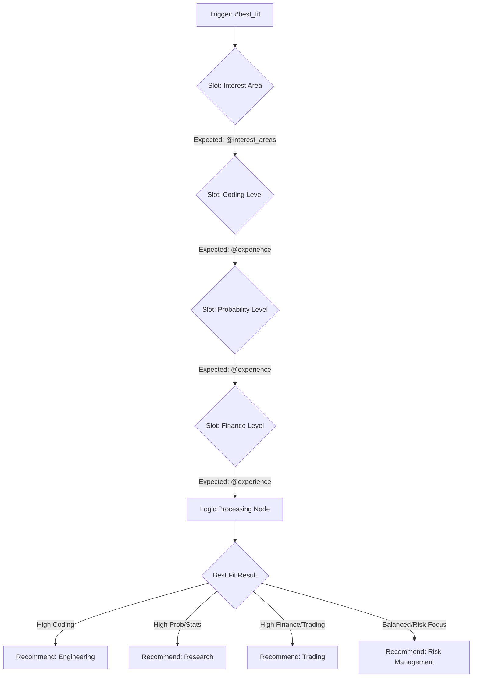
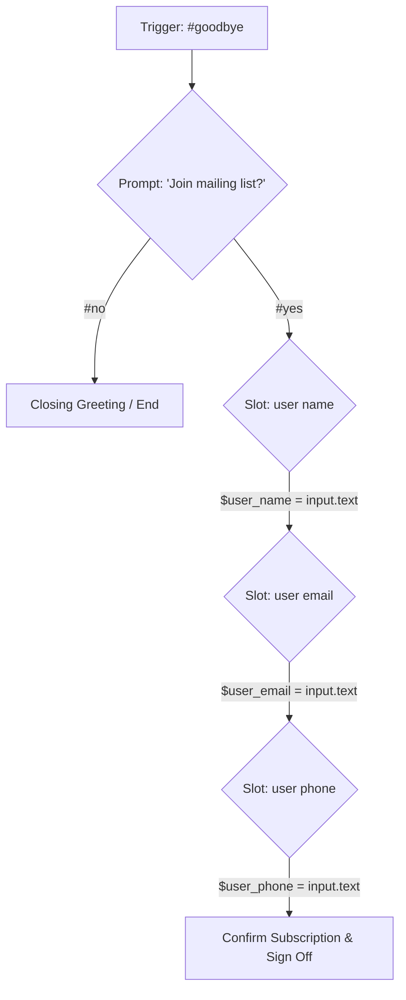
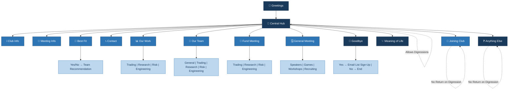

# CU Quants Chat Bot
## Background and Scenario Overview
CU Quants is CU Boulder's quantitative finance club of which both members of this team are a part of. Our club is quite large, somewhat complex, and not the most advertised organization around campus. Based on our experience in leadership positions for CU Quants, we have noticed that many new or potential members have difficulty finding us. That being said, we do have a [website](https://www.cuquants.com/) and like to first send potential members there. Unfortunately, the website is difficult to navigate unless you know where you are going or have a good abount of free time. The goal of our chat bot is to aleviate this issue, help our potential new members, and increase traffic to our meetings.

The chat bot we have created, described in more detail in the following sections, serves to help visitors to the site access the information more easily. Whether it be learning more about our club's history, mission statement, structure, or application process, our chat bot should be able to help.

In the following sections, we will first outline the structure of our bot through the intents and entities employed. Next, we will explore the context variables we chose to use as well as the slot flow for the application help. Finally, we will walk through the digressions and expected flows before talking about our edge cases and plans for future improvement.

For deployment, we have created a mock website to mimic the [official CU Quants website](https://www.cuquants.com/) as we do not have access to launch it directly. If you would like to better explore the functionality of the chat bot, I would use it in conjunction with the website linked above.

For the time being this mock website is https://aidenrudd1.github.io/CU-Quant-Chat-Bot/ created using GitHub Pages. I will also be linking the gihub Repo where everything including this file will be stored. https://github.com/aidenrudd1/CU-Quant-Chat-Bot

## Intents \& Entities
### Intents Used
The CU Quants Chat Bot employs a multitude of intents in order to aid in dialog and digressions. The high number if intents is due to the complexity of the chat bot. In order to handle the number of discussion nodes we felt were required to make the chat bot satisfactory for the usecase outlined above, we needed an intent for every node. The intents included in our bot are listed in the following table.

| Intent | Description | Example Utterances | Why It Was Included |
|---|---|---|---|
| **yes** | Captures affirmative responses so the bot knows to proceed, confirm, or provide more information. | • "yes please" • "sounds good" • "i'm interested" | Essential for any decision-tree chatbot; lets the bot distinguish agreement from neutrality or refusal. |
| **no** | Captures negative or disinterested responses so the bot can redirect or close a conversation thread. | • "nah" • "not interested" • "maybe later" | Prevents the bot from continuing down an unwanted path and allows graceful redirection. |
| **greetings** | Detects when a user is opening or initiating a conversation with the chatbot. | • "hey there" • "hello! i have some questions" • "hi i want to learn about cu quants" | A welcoming response at the start of a conversation sets a positive tone and guides users to ask their first question. |
| **goodbye** | Detects when a user is ending or wrapping up their conversation. | • "thanks bye" • "that's all i needed" • "i'm all set thanks" | Allows the bot to close the conversation warmly and prompt for any final questions before signing off. |
| **about_club** | Triggered when a user wants general background information about CU Quants — its purpose, history, or mission. | • "what is cu quants" • "what does this club do" • "when was cu quants founded" | Many visitors will land on the site with no prior knowledge; this intent ensures they can get a clear, immediate overview. |
| **meeting_info** | Triggered when a user wants specifics about club meetings — timing, location, format, or attendance policies. | • "when are the meetings" • "where do you meet" • "is attendance mandatory" | Meeting logistics are among the most common questions prospective members have and are critical for participation. |
| **join_club** | Triggered when a user wants to know how to join CU Quants or apply to the fund. | • "how do i join" • "how do i apply to the fund" • "when does recruiting happen" | Joining information is the most actionable intent for a prospective member; making it easy to find encourages recruitment. |
| **club_membership** | Triggered when a user wants to understand the different types of membership and what each entails. | • "what types of members are there" • "is membership free" • "what do members get access to" | CU Quants has distinct membership tracks (general vs. fund); clarifying these helps users self-select appropriately. |
| **roles** | Triggered when a user wants to learn about the specific roles within the quantitative fund. | • "what roles are in the fund" • "what does a risk analyst do" • "what role fits a programmer" | Understanding roles helps applicants target the right position and set expectations before applying. |
| **leadership_position** | Triggered when a user asks about the club's leadership structure, exec board, or team leads. | • "who leads the club" • "who is on the executive board" • "who is the head of research" | Transparency about leadership builds trust and helps users know who to contact for specific matters. |
| **contacts** | Triggered when a user wants to know how to get in touch with the club, its officers, or team leads. | • "how do i contact cu quants" • "do you have an instagram" • "how do i join the groupme" | Providing clear contact pathways ensures users can follow up on questions the chatbot cannot fully answer. |
| **best_fit** | Triggered when a user is asking for a personalized recommendation — e.g., whether to attend general meetings, apply to the fund, or which team to join. | • "what is best for me" • "i like coding which team should i join" • "i'm a freshman what should i do" | This intent adds real value by guiding undecided users toward the right path based on their background and interests. |
| **our_work** | Triggered when a user wants to see or learn about work, research, or results produced by the CU Quants fund. | • "what has the fund produced" • "does cu quants publish any research" • "what is the fund's performance" | Showcasing the fund's output demonstrates credibility and motivates prospective members by showing what they could be part of. |
| **meaning_of_life** | Triggered when a user asks about the meaning, purpose, or point of life — including philosophical and pop culture phrasings. | • "what is the meaning of life" • "why are we here" • "what is 42" | A fun easter egg intent that adds personality to the bot and handles off-topic existential questions with a lighthearted response rather than a fallback error. |

### Entities Used
Like the intents, the CU Quants Chat Bot uses a considerable number of entities. Again, we chose to utilize a number of entities to better elucidate the user's needs from our chat bot as well as for it to respond accordingly. The entities used in our chat bot are listed below in the following table.

| Entity | Description | Example Values | Why It Was Included |
|---|---|---|---|
| **skills** | Technical and quantitative skills relevant to club membership and fund roles. | • Python • Machine Learning • Financial Modeling | Allows the bot to understand a user's background and recommend the most suitable role or team within the fund. |
| **member_types** | The different categories of membership available in CU Quants. | • General Member • Fund Member • New Member | Helps the bot distinguish between membership tracks when answering questions about joining, benefits, or expectations. |
| **leadership_positions** | Named leadership roles within the club's executive board and fund teams. | • President • Head of Research • Executive Board | Enables the bot to answer questions about who runs the club and direct users to the right person for specific inquiries. |
| **resources** | Tools, platforms, and materials that members have access to. | • Bloomberg Terminal • GitHub • EigenPrep | Lets the bot inform users about what resources are available to them and how to access them as a member. |
| **interest_areas** | Academic and professional interest areas that align with the club's focus. | • Algorithmic Trading • Data Science • Derivatives | Helps the bot match a user's stated interests to relevant roles, teams, or membership tracks within the club. |
| **fund_roles** | The specific roles a member can hold within the quantitative fund. | • Trader • Researcher • Risk Analyst | Critical for guiding users through fund applications and helping them understand what each position involves. |
| **fund_teams** | The four operational teams that make up the CU Quants fund. | • Trading • Research • Engineering | Allows the bot to answer team-specific questions and route users toward the team that best fits their background. |
| **events** | The types of events and meetings hosted by CU Quants throughout the semester. | • General Meeting • Info Meeting • Guest Speaker | Helps the bot respond to questions about what's happening, what to attend, and what different events involve. |
| **contact_topics** | The subjects a user might want to reach out about or get directed to someone for. | • Fund Application • Attendance Policy • General Information | Enables the bot to route contact-related questions to the right person or resource rather than giving a generic response. |
| **name** | Over 1,000 common first names (male and female) with lowercase and uppercase variants included for each. | • James / james / JAMES • Sophia / sophia / SOPHIA • Mateo / mateo / MATEO | Used to recognize a user's name during mailing list sign-up regardless of how they capitalize it. Broad coverage reduces misses on less common names. |
| **email** | Email addresses in common formats across major providers and .edu domains. | • jsmith@colorado.edu • sarah.martinez22@gmail.com • d.kim@icloud.com | Primary identifier for adding a user to the CU Quants mailing list and sending club announcements. |
| **phone_number** | Phone numbers across the most common US formats including dashes, parentheses, dots, and country code variants. | • 303-555-1234 • (720) 555-9876 • +1-303-555-4567 | Allows the club to optionally collect a phone number for SMS updates or GroupMe invitations during onboarding. |
| **experience** | Experience level indication. | • Beginner • Intermediate • Advanced | Used to indicate expereience level for best_fit slot prompts. |

## Context Variables Used
In order to maintain certain fields throughout conversations, we make use of context variables in our chat bot. Whether we are personalizing responses or collecting information for decisions down the line, context variables are used. The context variables we chose to employ are outlined in the table below.

| Context Variable | Data Type | Possible Values | How It Gets Set | Why It Was Included |
|---|---|---|---|---|
| **$user_name** | String | Any text input (e.g., "John Smith") | Captured from user response when bot asks for their name during mailing list sign-up. Stored via `$user_name = input.text` | Personalizes the conversation and is stored as part of the mailing list record for follow-up communications. |
| **$user_email** | String | Any email format (e.g., "jsmith@colorado.edu") | Captured from user response when bot asks for their email during mailing list sign-up. Stored via `$user_email = input.text` | Primary identifier for adding a user to the CU Quants mailing list and sending club announcements. |
| **$user_phone** | String | Any phone format (e.g., "303-555-1234") | Captured from user response when bot asks for their phone number during mailing list sign-up. Stored via `$user_phone = input.text` | Optional contact method for SMS updates or GroupMe invitations during club onboarding. |
| **$coding_experience** | String | `beginner` / `intermediate` / `advanced` | Set based on user's response when asked about their programming background. Factors into the best fit recommendation. | Coding proficiency is a strong indicator of fit for the Engineering team and helps distinguish between fund roles more broadly. |
| **$probability_experience** | String | `beginner` / `intermediate` / `advanced` | Set based on user's response when asked about their statistics and probability background. Factors into the best fit recommendation. | Probability and statistics knowledge is most critical for the Research and Risk Management teams, making this a key differentiator. |
| **$trading_experience** | String | `beginner` / `intermediate` / `advanced` | Set based on user's response when asked about their finance or trading background. Factors into the best fit recommendation. | Trading knowledge is the primary indicator of fit for the Trading team and helps the bot avoid recommending advanced roles to beginners. |
| **$team_interest** | String | `Trading` / `Research` / `Engineering` / `Risk Management` | Set based on user's stated team preference when asked which area of the fund interests them most. | Captures the user's own preference to be weighed alongside their experience levels when generating a best fit recommendation. |

## Slot Flow
For two of our dialog nodes, *Best_Fit* and *Goodbye*, we are leveraging slots to acquire specific fields from our user to have a better user experience and be more helpful. We are able to directly propmpt the user for specific types of responses so we can construct personalized responses. In the following sections, we will look at both dialog nodes and the slot flow.

### Best Fit
This dialog node is triggered when the user is looking for feedback or recommendations for what team they should apply for for the fund. In this node, we utilize slots to prompt users to acquire information regarding the user's background, interests, experience levels and more. Using this, in conjuction with some logic and if statements, we can reccomend their *best-fit team* with some degree of accuracy. The diagram below outlines the slot flow and the fields it is expecting.

### Goodbye
This dialog node is triggered when the bot identifies that the user is ending the conversation. When this occurs, the chat bot asks the user if they would like to be added to our mailing list(s). If they answer in the affirmative, the bot will then ask for information such as the user's name, their email, and their phone number. The diagram below outlines the slot flow for this node.

## Digressions \& Chat Flow
As mentioned earlier, the chat bot has a wide range of capabilities to aid the user better understand the information found on the CU Quants website. In order to handle this wide range of user requests and conversations, we opted to structure our chat bot dialog using a *hub-and-spoke* design. A full diagram of our dialog is shown below.

As seen above, the conversation starts with a greeting message and an opening prompt. This opening prompt encourages the user to ask questions or interact with the chat bot in a manner in which the chat bot is designed to handle. The chat dialoge then passes to the central hub. Here the bot listens for requests and passes on to the spoke nodes upon identifying the intents included above. Once inside one of the spoke nodes, the dialog can digress into child nodes before being routed back to the central hub to field more prompts.

## User Examples
Below are some examples of how the chat bot operates in use.

### Example 1 (Successful slot completion):

-------

**User – 10:44 PM**  
Hello how are you?

**Assistant – 10:44 PM**  
Hi! Welcome to CU Quants. I'm here to help answer questions about the club.

Is there anything you would like to explore about CU Quants?

Here are some of the things I can help with:

- Learn more about the club  
- Learn when the club meets  
- Tell you about the General Meeting  
- Tell you about the fund  
- Who is on our team  
- What we're currently working on  
- What role might be a good fit for you  

---

**User – 10:45 PM**  
Tell me about the club

**Assistant – 10:45 PM**  
CU Quants is a student organization focused on quantitative finance, algorithmic trading, and the math and coding that make it possible. Students with backgrounds in fields like statistics, mathematics, computer science, finance, and more come together to learn about and apply these skills.

CU Quants is divided into two groups: a **General Meeting** and **The Fund**, where students work on real projects and gain experience trading live currencies.

If you would like to hear more about the structure, I would be happy to elaborate on either the **General Meeting** or **The Fund**.

---

**User – 10:45 PM**  
Tell me more about the general meeting

**Assistant – 10:45 PM**  
The club has a weekly **general meeting** open to all CU students. At these meetings we explore the world of quantitative finance and help students interested in the field through activities like trading games and industry discussions.

Occasionally we also host social events where speakers come in and present about their own experiences in quantitative finance. Other meetings may focus on trading games, interview preparation, or recruiting events.

Would you like to hear more about any of these activities?

*(Social Events, Games, Interview Prep, or Networking Events)*

---

**User – 10:45 PM**  
social events

**Assistant – 10:45 PM**  
Our organization puts a heavy emphasis on learning about real-world applications. A great way to do this is by inviting experts in the field to come speak about their work and experiences.

Recently we hosted:

- **Glenn Casterline** – Presented on bond issuance consulting to the CU Quants group.  
- **Kenna Miles** – Presented about her role as a quantitative trader, describing what she focuses on, what a typical day looks like, and answering questions from students.

Would you like to hear about any other general meeting activities?

---

**User – 10:46 PM**  
yes

**Assistant – 10:46 PM**  
The club has a weekly general meeting open to all CU students. At these meetings, we learn about the quantitative finance world and help students interested in the field by playing trading games and learning about the industry.

Occasionally we also host speakers and run activities such as:

- Social events  
- Trading games  
- Interview preparation  
- Networking events

Would you like to hear more about any of these activities?

---

**User – 10:46 PM**  
interview prep

**Assistant – 10:46 PM**  
While the club has a great time during general meetings, leadership recognizes that it is also important to prepare members for their careers.

Some meetings are dedicated to **interview preparation**, where members work through interview questions selected by club leadership. These questions are specifically tailored to quantitative finance opportunities.

One of the primary goals of the club is to help members land internships and jobs, and these sessions significantly improve those chances.

Would you like to hear about any other general meeting activities?

---

**User – 10:46 PM**  
no

**Assistant – 10:46 PM**  
Is there anything else you would like to explore about CU Quants?

Here are some things I can help with:

- Learn more about the club  
- Learn when the club meets  
- Tell you about the General Meeting  
- Tell you about the fund  
- Who is on our team  
- What we're currently working on  
- What role might be a good fit for you  

---

**User – 10:47 PM**  
goodbye

**Assistant – 10:47 PM**  
Before you leave, would you be interested in telling us your name and graduation year so we can keep in contact with you in the future?

---

**User – 10:47 PM**  
yes

**Assistant – 10:47 PM**  
Great, what is your name?

---

**User – 10:47 PM**  
Aiden

**Assistant – 10:47 PM**  
What year do you graduate?

---

**User – 10:47 PM**  
2027

**Assistant – 10:47 PM**  
Perfect Aiden, of graduating class **2027**, we will be in contact shortly. Come back if you have any other questions!

---

This first example is very important as it demosntrate a few key features of our chat bot. First note that we employ a central hub, we allow the conversation to flow naturally allowing the user to ask questions as they please. Note that when asking about the general meeting the chat bot introduces four new topics. (Social events, Trading Games, Interview Preparation, and Networking Events). Instead of talking about all four it asks teh user if they are curious about any of them, waits for a response and then moves to that new sub node. After that sub node ends it again prompts the user if they are interested in any other general meeting topic. If the user expresses a positive "yes" intent, the bot moves back to the general meeting node. In the event that the user is not interested, the bot moves back to the central hub. This is a key feature of our chatbot, allowing for a more natural and less rigid conversation flow. The central hub then opens up the conversation to new ideas again. 

When the user says "goodbye" the bot understands and send the user to the final nodes. It prompts the user one last time asking the if they would like to have there information saved, so that they can be contacted later. Here we see, the bot ask for the users name and also the users graduation year. Both of these show a use of slots and saving that information into the bots memory. This is clear in the final message, when the bot tells the user "Thanks Aiden, of graduating class **2027**, we will be in contact shortly. Come back if you have any other questions!". Alternatively, the user does not have to give the bot information, upon answering no to the question of saving there information, the bot simply ends the conversation. 

### Example 2(Digression mid-flow + return):

---

**User – 11:07 PM**  
hello

**Assistant – 11:07 PM**  
Hi! Welcome to CU Quants. I'm here to help answer questions about the club.

Is there anything you would like to explore about CU Quants?

Here are some of the things I can help with:

- Learn more about the club  
- Learn when the club meets  
- Tell you about the General Meeting  
- Tell you about the fund  
- Who is on our team  
- What we're currently working on  
- What role might be a good fit for you  

---

**User – 11:07 PM**  
tell me about the fund

**Assistant – 11:07 PM**  
The CU Quants fund is our hands-on quantitative trading program where members work on real research, trading systems, and risk management tools.

The fund is organized into several teams that focus on different parts of the trading process:

- **Trading** – executing strategies and monitoring markets  
- **Research** – developing models and trading strategies  
- **Engineering** – building trading infrastructure and systems  
- **Risk Management** – monitoring exposure and managing risk  

You can ask me about any of these teams, or I can help you find which team might be the best fit for you.

---

**User – 11:07 PM**  
help me find the best fit

**Assistant – 11:07 PM**  
CU Quants is a great fit for students interested in quantitative finance, trading, data science, and applied mathematics.

Members often come from backgrounds such as:

- Mathematics  
- Statistics  
- Computer Science  
- Economics  
- Engineering  

However, students from many different majors participate and learn together.

Would you be interested in telling me more about yourself so that we can pick out the perfect role for you?  
*(Please answer: Yes or No)*

---

**User – 11:07 PM**  
when does the club meet

**Assistant – 11:07 PM**  
Our club meets every **Tuesday night in CASE E240 from 5–6 PM**.

CU Quants is a great fit for students interested in quantitative finance, trading, data science, and applied mathematics.

Members often come from backgrounds such as:

- Mathematics  
- Statistics  
- Computer Science  
- Economics  
- Engineering  

However, students from many different majors participate and learn together.

Would you be interested in telling me more about yourself so that we can pick out the perfect role for you?  
*(Please answer: Yes or No)*

---

**User – 11:07 PM**  
yes

**Assistant – 11:07 PM**  
What are you most interested in: **trading, research, risk, engineering, or general learning?**

---

**User – 11:07 PM**  
trading

**Assistant – 11:07 PM**  
That's a great choice!

How would you rate your coding level: **beginner, intermediate, or advanced?**

---

**User – 11:07 PM**  
advanced

**Assistant – 11:07 PM**  
Got it!

How would you rate your understanding of **probability**?

---

**User – 11:07 PM**  
intermediate

**Assistant – 11:07 PM**  
How would you rate your understanding of **finance and market microstructure**?

---

**User – 11:07 PM**  
intermediate

**Assistant – 11:07 PM**  
Thanks! Here's what I learned about you:

- **Team Interest:** Trading  
- **Coding Knowledge:** Advanced  
- **Probability Knowledge:** Intermediate  
- **Market Microstructure Knowledge:** Intermediate  

I think the **Trading Team** would be a great fit!

Is there anything you would like to explore about CU Quants?

Here are some of the things I can help with:

- Learn more about the club  
- Learn when the club meets  
- Tell you about the General Meeting  
- Tell you about the fund  
- Who is on our team  
- What we're currently working on  
- What role might be a good fit for you  

---

**User – 11:08 PM**  
goodbye

**Assistant – 11:08 PM**  
Before you leave would you be interested in telling us your **name and graduation year** so we can keep in contact with you in the future?

---

**User – 11:08 PM**  
no

**Assistant – 11:08 PM**  
If you have any more questions about CU Quants, such as joining the club, meeting information, our projects, or anything else, feel free to ask anytime.

Have a great day!

---

This example transcript between the user and the chat bot is really important because it shows some of the cool features we implemented. First, the user asks the bot about our fund. The bot describes it, and then offers the user multiple options to learn more about the teams that make up the fund, and also asks if the user would like to be told where he would best fit in. The user navigates to this new "best fit" node, and the bot immediately asks him if he is ok answering some questions to determine his fit. But, then the user randomely asks, when CU Quants meet. This is totally unrelated and prompts the bot to manuever to the "meeting time" node. The bot answers the question, and then naturally moves back to and continues the conversation about best fit. During which he asks the user for multiple pieces of information. These included, their preferred team, there coding ability, their probability ability, and also the students financial or market microstructure knowledge. The bot then takes in those saved memories summarizes them to the user, and then tells the user where it believes they should be. Followin this it sends the user back to the central hub, where the user exits. In this example the user declines to tell the bot more information, and thus is told goodbye. 

### Example 3(Failure case + recovery (fallback handling)):

---

**User – 11:20 PM**  
Hello

**Assistant – 11:20 PM**  
Hi! Welcome to CU Quants. I'm here to help answer questions about the club.

Is there anything you would like to explore about CU Quants?

Here are some of the things I can help with:

- Learn more about the club  
- Learn when the club meets  
- Tell you about the General Meeting  
- Tell you about the fund  
- Who is on our team  
- What we're currently working on  
- What role might be a good fit for you  

---

**User – 11:20 PM**  
check account balance

**Assistant – 11:20 PM**  
Sorry, I didn't quite understand that. Could you try rephrasing or ask me another question I am better equipped to answer.

Is there anything you would like to explore about CU Quants?

Here are some of the things I can help with:

- Learn more about the club  
- Learn when the club meets  
- Tell you about the General Meeting  
- Tell you about the fund  
- Who is on our team  
- What we're currently working on  
- What role might be a good fit for you  

---

**User – 11:21 PM**  
tell me about leadership

**Assistant – 11:21 PM**  
Our team is staffed with wonderful individuals. Each team has its own head that is responsible for day-to-day operations.

General fund leadership is organized across the following teams:

- Trading  
- Research  
- Risk Management  
- Engineering  

I would love to explore each of these leadership teams further — just ask!

---

**User – 11:21 PM**  
tell me more about general fund leadership

**Assistant – 11:21 PM**  
The general part of our fund is run by:

- **President & Co-Fund Manager:** Ryan Watts  
- **Senior Vice President:** Caden Patel  
- **Vice President of Finance & Co-Fund Manager:** Magnus Miller  
- **Vice President of Operations:** Russel Stevens  
- **Vice President of Marketing:** Veronica Ember  

Would you like to learn about the other teams?

---

**User – 11:21 PM**  
no

**Assistant – 11:21 PM**  
Is there anything you would like to explore about CU Quants?

Here are some of the things I can help with:

- Learn more about the club  
- Learn when the club meets  
- Tell you about the General Meeting  
- Tell you about the fund  
- Who is on our team  
- What we're currently working on  
- What role might be a good fit for you  

---

**User – 11:22 PM**  
what work is being done

**Assistant – 11:22 PM**  
CU Quants members work on a variety of quantitative finance and data science projects.

These projects can include:

- Algorithmic trading strategies  
- Financial data analysis  
- Machine learning for markets  
- Research on market microstructure  

Many projects involve collaborative research and building real tools used to study financial markets.

Would you like to learn more about one of the following teams’ recent research and work?

- Trading Team  
- Research Team  
- Risk Management Team  
- Engineering Team  

---

**User – 11:22 PM**  
what is the engineering team working on

**Assistant – 11:22 PM**  
The engineering team is currently building a **web-based trading terminal** for the CU Quants trading team to use. This is a major project and will make the trading team members’ lives much easier.

Do you want to see what the other teams are working on?

---

**User – 11:22 PM**  
who is the engineering team leadership

**Assistant – 11:22 PM**  
Our team is staffed with wonderful individuals. Each team has its own head that is responsible for day-to-day operations.

General fund leadership includes the following teams:

- Trading  
- Research  
- Risk Management  
- Engineering  

I would love to explore each of these leadership teams further — just ask!

---

**User – 11:23 PM**  
engineering team leadership

**Assistant – 11:23 PM**  
Did you mean:

- Engineering Members  
- Central Hub  
- None of the above  

---

**User – 11:23 PM**  
leadership of engineering

**Assistant – 11:23 PM**  
The engineering team is tasked with building all of our important infrastructure and helps support the other teams when they need it.

They are led by:

- **Alex Savard — Engineering Team Lead**

Would you like to learn about the other teams?

---

**User – 11:23 PM**  
no

**Assistant – 11:23 PM**  
Is there anything you would like to explore about CU Quants?

Here are some of the things I can help with:

- Learn more about the club  
- Learn when the club meets  
- Tell you about the General Meeting  
- Tell you about the fund  
- Who is on our team  
- What we're currently working on  
- What role might be a good fit for you  

---

**User – 11:23 PM**  
Thank you

**Assistant – 11:23 PM**  
Before you leave, would you be interested in telling us your **name and graduation year** so we can keep in contact with you in the future?

---

**User – 11:23 PM**  
no

**Assistant – 11:23 PM**  
If you have any more questions about CU Quants, such as joining the club, meeting information, our projects, or anything else, feel free to ask anytime.

Have a great day!

---

I wanted to add this third transcript because it illustrates some of the weaknesses of the chat bot in its current state, but also how it often times overcomes simple mistakes. This transcript begins with the user asking to check their account balance. Maybe a trader got really confused or just terrible typo. Eithe way, that is not something that this bot is designed to handle. It doesn't freak out, instead it simply says, It doesn't know how to help with that, gets mapped to its central hub, and then responds with some suggestions of what it can do for the user. The user then carries on and uses the prompts suggested by the chat bot. Further down in the covnersation we run into anothe error. We are exploring the leadership for each different team. The user asks "who is the engineering team leadership", the chat bot understood the question pertained to leadership, but accidently mapped it to the general broad leadership page, rather than the specific teams. The user then asks once more in slightly different wording, "leadership of engineering", and the chat bot then correcly identifies where it should go and begins to discuss the leadership of the engineering team. So overall, as a result of the size of the chat bot, and also reoccuring concepts like (Research team, research leadership, research projects, etc) the chat bot can get confused, but in general it has a healthy safety mechanism to revert to its central hub, and can often pick it up with slightly different phrasing.  

## Shortfalls \& Future Improvements
### Chat Bot Shortfalls Now
The chat bot currently has a few shortcomings that need to be acknowledged.

1. **Dialogue Node Issues** -- Due to the complexity of the website and how we have designed the chatbot, we have issues with dialog flow in relation to the different teams within the fund. Based on our design, we often check for the *role* entity in a user's prompt. Unfortunately, this entity is involved in many of our dialog nodes so the chat bot can enter into a dialog node that might not be the best fit based on the user's intent.

2. **Error Handling** -- As of now, our chat bot uses the pre-defined \#anything_else intent native to the platform to identify prompts that are outside of the scope of the bot. While this allows us to identify out-of-scope prompts, our handling of the dialogue following a prompt of this nature could use improvement to improve the user experience.

3. **Personalization** -- A big flaw that we noticed with the current implementation is that most of the chat bot's responses are generic and not personalized based user's input. While this is not necessary for functionality of the bot, it does make the experience less engaging. Functionality is a major development area, but so is user experience.

### Possible Improvements for the Future
In addition to addressing the shortfalls listed above, we have identified the following as possible improvements for future versions.

1. **Enhanced Recommendations** -- As mentioned earlier, our bot uses user input stored as context variables along with some *very basic* logic filters in order to recommend a best fitting fund team. In the future, we could incorporate a more sophisticated recommendation model that takes into account additional factors for more informative and better fitting recommendations.

2. **Contact \& Human Escalation** -- While we do currently have capability to reccomend resources for how to contact the club, it would be nice to incorporate functionality for the bot to directly escalate issues or concerns to a human representative via existing communication channels. Again, this is not a necessity but does improve the user experience.